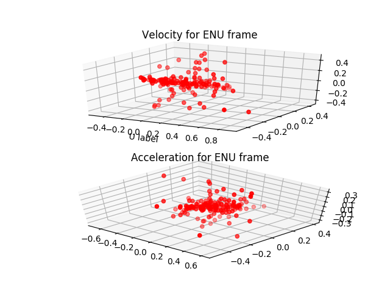

# ECEF2CENU
A program to transform coordinates into an ENU frame

# Overview
The program reads from the text file the ECEF coordinates, then by applying 
matrix multiplication, transforms ECEF to an ENU frame relative to the first 
coordinate in the text file. From then on, the program interpolates velocity 
and acceleration. First, the program finds the difference between each ENU component between two vectors and divides by the change in time. Then, the program stores the velocity as a vector, and the acceleration is computed as the difference between two velocity vectors divided by change in time. The graphs below and after running the program display the velocity and acceleration vector for each point in the text file.  

# Graphs

# Software Requirements 

Ensure you have Python 2.7 installed. Download from [here](https://www.python.org/downloads/).

Also ensure you have the numpy, mpl_toolkits.mplot3d, and matplotlib.pyplot packages installed for python. If not installed, follow the instructions [here](https://matplotlib.org/faq/installing_faq.html#clean-install). 

# Instructions

run `git clone git@github.com:codecofee19/ECEF2CENU.git` or 

`git clone https://github.com/codecofee19/ECEF2CENU.git` 

run  `cd ECEF2CENU`

run  `python ecef2enu.py` 

# References 

https://en.wikipedia.org/wiki/Geographic_coordinate_conversion#From_ECEF_to_ENU

http://www.navipedia.net/index.php/Transformations_between_ECEF_and_ENU_coordinates

http://www.nosco.ch/mathematics/en/earth-coordinates.php  

http://galileoandeinstein.physics.virginia.edu/142E/10_1425_web_ppt_pdfs/10_1425_web_Lec_04_2D_Motion.pdf
